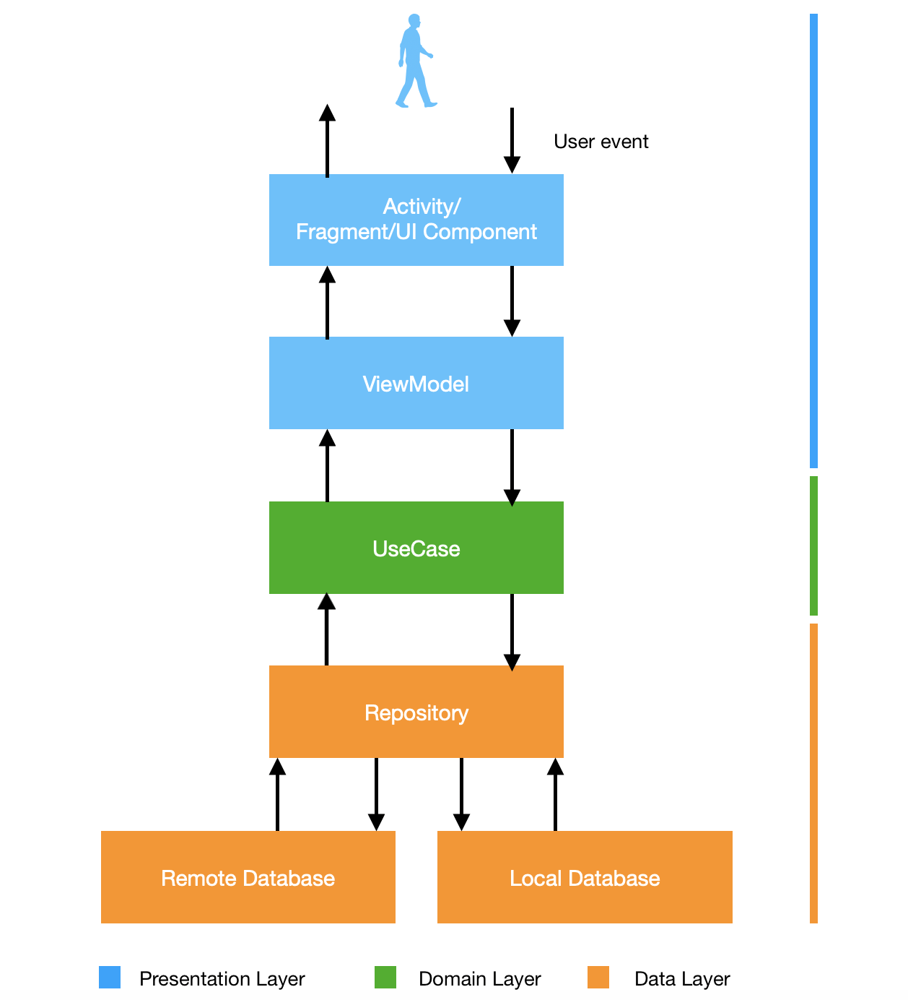

# Buscador de Mercado Libre

Es una aplicación desarrollada en Kotlin usando la Api pública de
Mercado Libre.

La aplicación contiene una pantalla de búsqueda, donde se muestra el
resultado de la búsqueda y otra pantalla donde se muestra el detalle
de los productos, además hae uso de Clean Architecture.

## Screenshoots

## Arquitectura
La arquitectura de este proyecto sigue los principios básicos de Clean
Architecture. Al usar esta arquitectura, se separa la UI, la lógica
de negocio y las fuentes de datos. Además facilita el desarrollo de Unit
Tests.

A continuación una diagrama de cómo lo implementa:

### Presentation Layer
En esta capa se encuentra todo lo relacionado a las vistas (activities,
fragments, views) las cuales no continene lógica de negocio, sino lógica
enfocada a las vistas. Para esta capa utilicé el patrón MVVM y LiveData
para notificar los eventos y mantener los datos siempre actualizados.  
LiveData está asociado al ciclo de vida de nuestra Activity/Fragment,
por lo que no se llamarán a los observables si la vista no se encuentra
activa, y si el objeto es destruido, los observables liberan la memoria.

### Domain Layer
En esta capa ocurre toda la lógica de negocio. En esta capa se encuetran
los UseCases que interactúa con la capa de datos y presentación.

### Data Layer
Esta capa es donde se obtienen los datos. Para esta capa hacemos uso del
Repository Pattern, que es un patrón que permite abstraer el orden de
datos.

## Dependencias

- Android Architecture Components
  - [View Binding](https://developer.android.com/topic/libraries/view-binding)
    para acceder las vistas
  - [Lifecycle](https://developer.android.com/topic/libraries/architecture/lifecycle)
    para crear una UI que responda a los eventos del ciclo de vida.
  - [LiveData](https://developer.android.com/topic/libraries/architecture/livedata)para
    crear objetos de datos que notifiquen a las vistas cuando cambien de
    estado
  - [ViewModel](https://developer.android.com/topic/libraries/architecture/viewmodel)
    para almacenar y administrar datos relacionados a la UI, mantiene el
    estado de los datos en cambios de configuraciones.
- Terceros:
  - [Retrofit](https://square.github.io/retrofit/) cliente HTTP seguro
    para Android y Java
  - [OkHttp3](https://square.github.io/okhttp/) cliente HTTP para
    Android y Java
  - [ReactiveX](https://github.com/ReactiveX) librería para aplicar
    programación reactiva, está basada en eventos mediante el uso de
    Observables.
  - [Dagger Hilt](https://dagger.dev/hilt/) para inyección de
    dependencias
  - [Glide](https://bumptech.github.io/glide/) para cargar imágenes
  - [Mockito](https://site.mockito.org/) framework para mockear datos en
    test unitarios.
